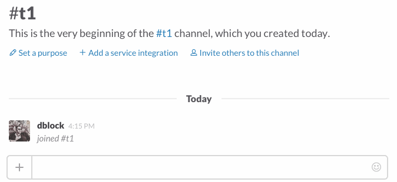

Slack Ruby Client
=================

[](http://badge.fury.io/rb/slack-ruby-client)
[](https://travis-ci.org/dblock/slack-ruby-client)

A Ruby client for the Slack [Web](https://api.slack.com/web) and [RealTime Messaging](https://api.slack.com/rtm) APIs.

## Installation

Add to Gemfile.

```
gem 'slack-ruby-client'
```

Run `bundle install`.

## Usage

### Create a New Bot Integration

This is something done in Slack, under [integrations](https://artsy.slack.com/services). Create a [new bot](https://artsy.slack.com/services/new/bot), and note its API token.


### Use the API Token

```ruby
Slack.configure do |config|
  config.token = ENV['SLACK_API_TOKEN']
end
```

### Web Client

The Slack Web API allows you to build applications that interact with Slack. For example, send messages with [chat_PostMessage](https://api.slack.com/methods/chat.postMessage).

```ruby
client = Slack::Web::Client.new

client.auth_test

general_channel = client.channels_list['channels'].detect { |c| c['name'] == 't3' }

client.chat_postMessage(channel: general_channel['id'], text: 'Hello World', as_user: true)
```

See a fully working example in [examples/hi_web](examples/hi_web/hi.rb).


Refer to the [Slack Web API Method Reference](https://api.slack.com/methods) for the list of all available functions.

You can configure the Web client either globally or via the initializer.

```ruby
Slack::Web::Client.config do |config|
  config.user_agent = 'Slack Ruby Client/1.0'
end
```

```ruby
client = Slack::Web::Client.new(user_agent: 'Slack Ruby Client/1.0')
```

The following settings are supported.

setting      | description
-------------|-------------------------------------------------------------------------------------------------
user_agent   | User-agent, defaults to _Slack Ruby Client/version_.
proxy        | Optional HTTP proxy.
ca_path      | Optional SSL certificates path.
ca_file      | Optional SSL certificates file.
endpoint     | Slack endpoint, default is _https://slack.com/api_.

### RealTime Client

The Real Time Messaging API is a WebSocket-based API that allows you to receive events from Slack in real time and send messages as user.

```ruby
client = Slack::RealTime::Client.new

client.on :hello do
  puts "Successfully connected, welcome '#{client.self['name']}' to the '#{client.team['name']}' team at https://#{client.team['domain']}.slack.com."
end

client.on :message do |data|
  case data['text']
  when 'bot hi' then
    client.message channel: data['channel'], text: "Hi <@#{data['user']}>!"
  when /^bot/ then
    client.message channel: data['channel'], text: "Sorry <@#{data['user']}>, what?"
  end
end

client.start!
```

You can send typing indicators with `typing`.

```ruby
client.typing channel: data['channel']
```

You can send a ping with `ping`.

```ruby
client.ping
```

The client exposes the properties of [rtm.start](https://api.slack.com/methods/rtm.start) upon a successful connection.

property | description
---------|-------------------------------------------------------------------------------------------------
url      | A WebSocket Message Server URL.
self     | Details on the authenticated user.
team     | Details on the authenticated user's team.
users    | A list of user objects, one for every member of the team.
channels | A list of channel objects, one for every channel visible to the authenticated user.
groups   | A list of group objects, one for every group the authenticated user is in.
ims      | A list of IM objects, one for every direct message channel visible to the authenticated user.
bots     | Details of the integrations set up on this team.

You can configure the RealTime client either globally or via the initializer.

```ruby
Slack::RealTime::Client.config do |config|
  config.websocket_ping = 42
end
```

```ruby
client = Slack::RealTime::Client.new(websocket_ping: 42)
```

The following settings are supported.

setting        | description
---------------|--------------------------------------------------------------------------------------
websocket_ping | The number of seconds that indicates how often the WebSocket should send ping frames.

Note that the RealTime client uses a Web client to obtain the WebSocket URL via [rtm.start](https://api.slack.com/methods/rtm.start), configure Web client options via `Slack::Web::Client.configure` as described above.

See a fullly working example in [examples/hi_real_time](examples/hi_real_time/hi.rb).


### Combinging RealTime and Web Clients

Since the Web client is used to obtain the RealTime client's WebSocket URL, you can continue using the Web client in combination with the RealTime client.

```ruby
client = Slack::RealTime::Client.new

client.on :message do |data|
  case data['text']
  when 'bot hi' then
    client.web_client.chat_postMessage channel: data['channel'], text: "Hi <@#{data['user']}>!"
  when /^bot/ then
    client.web_client.chat_postMessage channel: data['channel'], text: "Sorry <@#{data['user']}>, what?"
  end
end

client.start!
```

See a fullly working example in [examples/hi_real_time_and_web](examples/hi_real_time_and_web/hi.rb).



## History

This gem is based on [slack-ruby-gem](https://github.com/aki017/slack-ruby-gem), but it more clearly separates the Web and RTM APIs, is more thoroughly tested and is in active development.

## Contributing

See [CONTRIBUTING](CONTRIBUTING.md).

## Copyright and License

Copyright (c) 2015, Daniel Doubrovkine, Artsy and [Contributors](CHANGELOG.md).

This project is licensed under the [MIT License](LICENSE.md).
